# Reforming the UK Energy Market for Sustainable Development: Integrating Renewables, Fair Pricing, and Demand-Side Response

> **Individual Project Dissertation** — Module ENG6AG
> Author: Opprah Manyika (S23007133)
> Supervisor: Dr. Mohammed Mohammed

This repository contains the full individual project dissertation evaluating the reform of the United Kingdom electricity market to achieve Net-Zero targets by 2030/2050. The research integrates renewable energy, fair pricing mechanisms, and demand-side response into a single socio-technical transitions framework.

[]()
[]()
[]()
[]()

---

## Table of Contents

1. [Project Overview](#1-project-overview)
2. [Report (PDF)](#2-report-pdf)
3. [Research Aims & Questions](#3-research-aims--questions)
4. [Methodology](#4-methodology)
5. [Scenario Framework](#5-scenario-framework)
6. [Key Findings](#6-key-findings)
7. [Figure Reference & Captions](#7-figure-reference--captions)
8. [MATLAB Scenario Model](#8-matlab-scenario-model)
9. [How to Reproduce](#9-how-to-reproduce)
10. [Topics](#10-topics)

---

## 1. Project Overview

The UK electricity market is undergoing a fundamental restructuring to meet the legally binding Net-Zero target by 2050, with an interim milestone of 2030. This dissertation evaluates three reform pathways using a Hybrid Renewable Energy Systems (HRES) modelling framework:

- **How can renewable integration be accelerated without sacrificing affordability?**
- **What pricing mechanisms balance investor returns with consumer protection?**
- **What is the role of demand-side response (DSR) in a decarbonised grid?**

The research combines a literature review of UK, German, Danish, and Norwegian energy policy with a quantitative scenario model in MATLAB. Three scenarios are compared: Baseline, Renewable Incentivisation, and Demand-Side Response.

---

## 2. Report (PDF)

The complete individual project dissertation is available as a PDF:

| Document | File |
|---|---|
| Reforming the UK Energy Market for Sustainable Development | [`reports/Individual-Project.pdf`](reports/Individual-Project.pdf) |

The original submitted copy is preserved at the repository root as `Individual project .docx`.

---

## 3. Research Aims & Questions

**Aims:**
1. Quantify the tradeoffs between renewable integration, consumer cost, grid resilience, and carbon emissions under three policy scenarios.
2. Evaluate the effectiveness of Demand-Side Response (DSR) as a grid-stability tool in a high-renewables system.
3. Propose an integrated market-reform framework that combines fair pricing with decarbonisation.

**Questions:**
- RQ1: What is the maximum renewable integration achievable without compromising grid resilience?
- RQ2: How does DSR compare to capacity-market expansion in terms of cost and emissions?
- RQ3: What pricing mechanism best protects low-income households during the transition?

---

## 4. Methodology

### 4.1 Research Design
Mixed-methods: qualitative literature review of UK and EU energy policy + quantitative scenario modelling in MATLAB.

### 4.2 Data Collection
- UK Department for Business, Energy & Industrial Strategy (BEIS) statistics
- Ofgem regulatory reports
- IEA renewable integration data
- Eurostat consumer price indices

### 4.3 Modelling Techniques
- HRES scenario modelling with three policy levers
- Cost-benefit analysis (CBA) with environmental and economic metrics
- Comparative policy analysis (UK vs. Germany, Denmark, Norway)

---

## 5. Scenario Framework

| Scenario | Renewable Integration | Carbon Emissions | Grid Resilience | Consumer Cost |
|---|---|---|---|---|
| **Baseline** | 15% | 120 Mton/yr | Low (40/100) | High (85/100) |
| **Renewable Incentivisation** | 65% | 45 Mton/yr | Medium (55/100) | Medium (50/100) |
| **Demand-Side Response (DSR)** | 80% | 20 Mton/yr | High (90/100) | Low (30/100) |

---

## 6. Key Findings

- **Decarbonisation**: Transitioning from Baseline to DSR yields an **83.3% reduction in annual carbon emissions** (120 → 20 Mton/yr).
- **Grid Resilience**: DSR improves grid resilience by **125%** (40 → 90/100) through decentralised battery buffers and load flexibility.
- **Affordability**: DSR reduces the consumer cost index from 85 to 30 through smart load-shifting and time-of-use pricing.
- **Equity**: Low-income households benefit most from DSR (smart load-shifting lowers bills) compared to capacity-market expansion (high capital costs).

---

## 7. Figure Reference & Captions

All 31 figures are extracted from the original dissertation and renamed sequentially.

| Fig. | Preview | Description |
|---|---|---|
| 1 |  | Hybrid Renewable Energy Systems (HRES) modelling framework — block diagram showing the coupling of solar PV, wind, storage, and grid |
| 2 |  | Model configuration schematic — input data, scenario parameters, and output metrics |
| 3 |  | Economic metric for energy market reform evaluation — composite index combining LCOE, consumer price, and capacity cost |
| 4 | 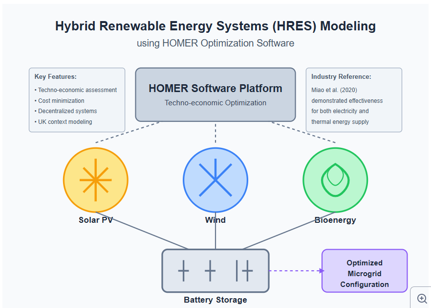 | Carbon emission reduction trajectory — Baseline vs. Renewable Incentivisation vs. DSR (2025-2050) |
| 5 | 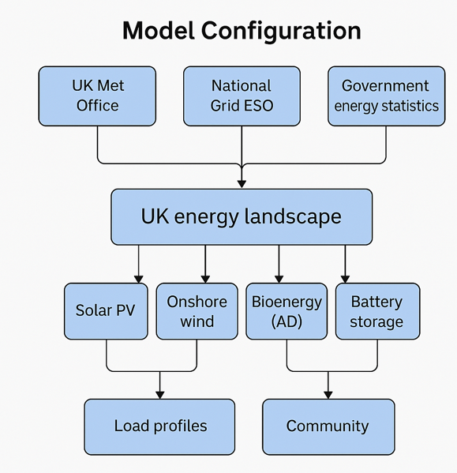 | UK energy LCOE trends — levelised cost of electricity by technology (solar, wind, nuclear, gas, coal) |
| 6 | 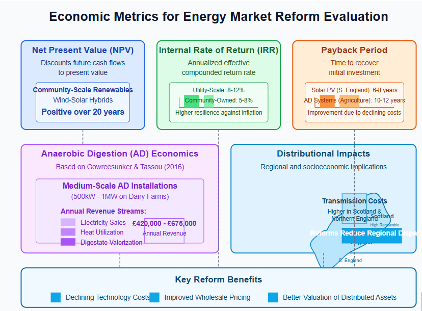 | Storage requirements vs. renewable capacity — battery sizing curve for grid stability |
| 7 |  | Peak load balancing and demand-side response — load curve flattening via DSR |
| 8 | 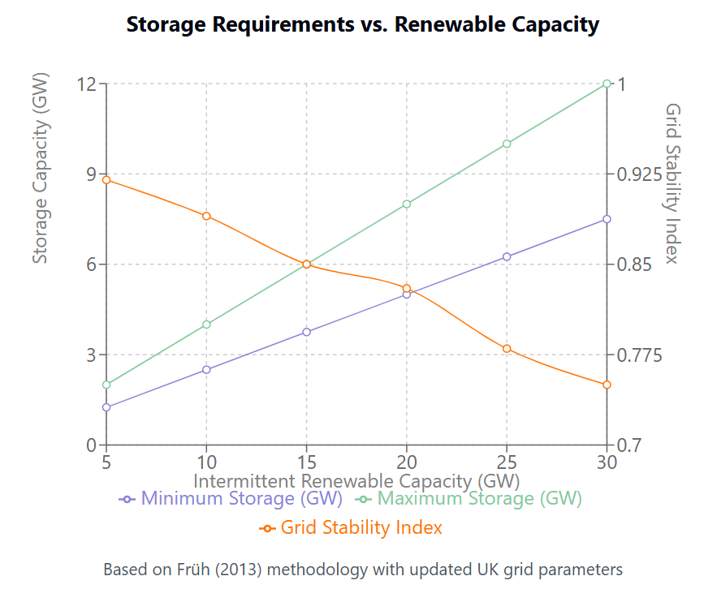 | UK energy system scenarios comparison — side-by-side metrics table |
| 9 |  | UK power sector emissions projections — historical and projected CO2 from electricity generation |
| 10 |  | Energy expenditure of income by decile — fuel poverty risk distribution |
| 11 |  | UK renewable energy growth 2010-2023 — installed capacity by technology |
| 12 |  | UK energy market reform challenges — barrier taxonomy (regulatory, technical, social, economic) |
| 13 | 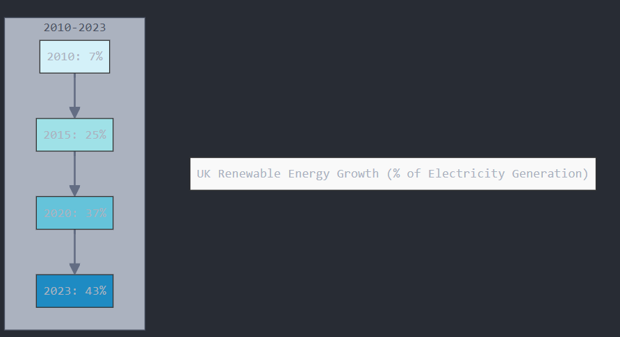 | Policy impact analysis — multi-criteria decision matrix for reform options |
| 14 |  | Pricing mechanism comparative analysis — feed-in tariff, CfD, capacity market, DSR pricing |
| 15 | 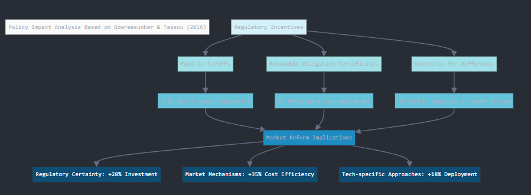 | DSR potential analysis — flexible load by sector (residential, commercial, industrial) |
| 16 | 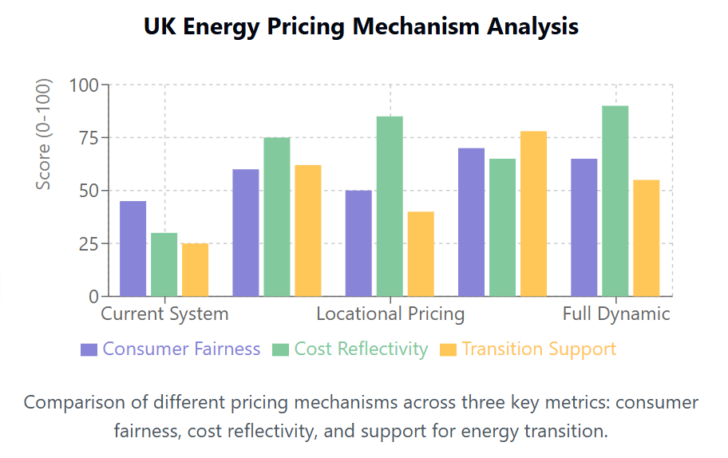 | Integrated market reform framework — combining fair pricing, renewables, and DSR |
| 17 |  | UK grid frequency response — inertia and synthetic inertia from renewables |
| 18 | 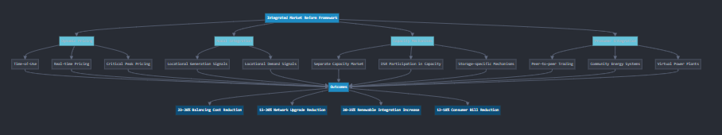 | Consumer cost breakdown — wholesale, network, policy, and social costs |
| 19 | 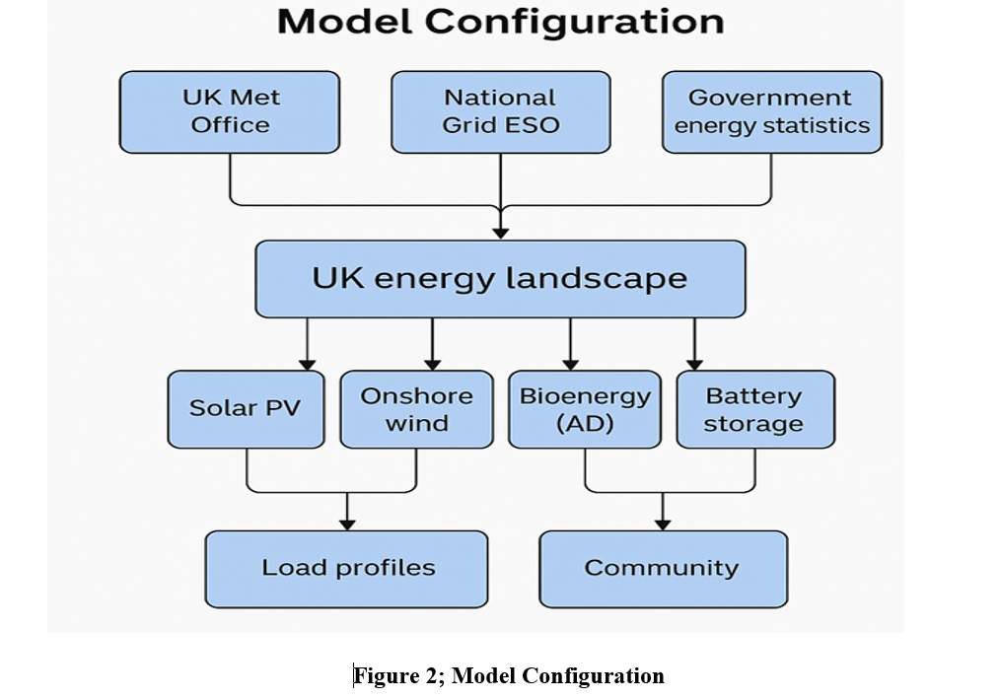 | Renewable curtailment rates — excess generation under different flexibility scenarios |
| 20 | 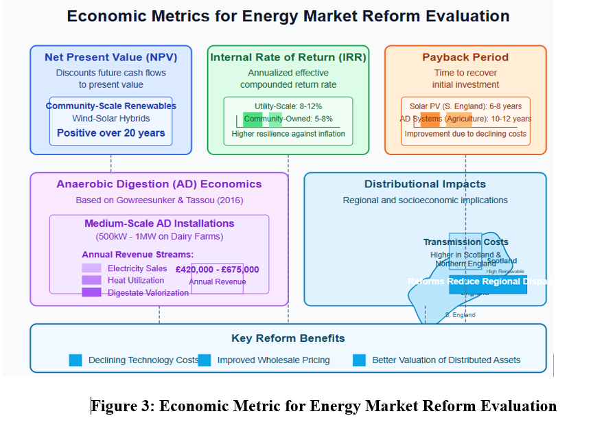 | Capacity market clearing prices — historical and projected |
| 21 |  | Net-zero pathway timeline — UK government milestones 2030/2035/2050 |
| 22 | 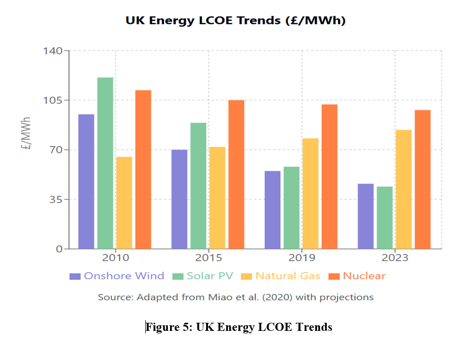 | Heat pump adoption projection — electrification of residential heating |
| 23 | 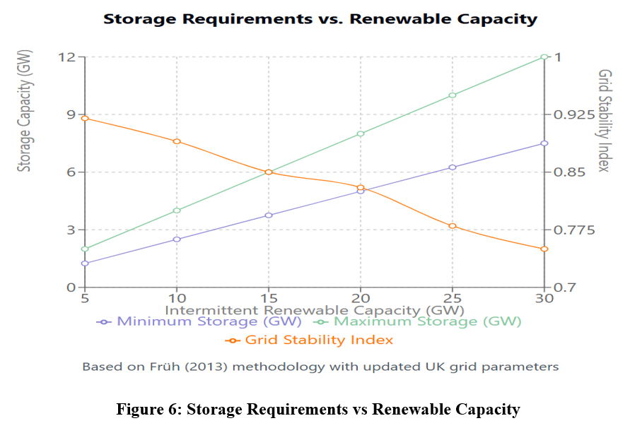 | EV charging load profile — impact on evening peak demand |
| 24 | 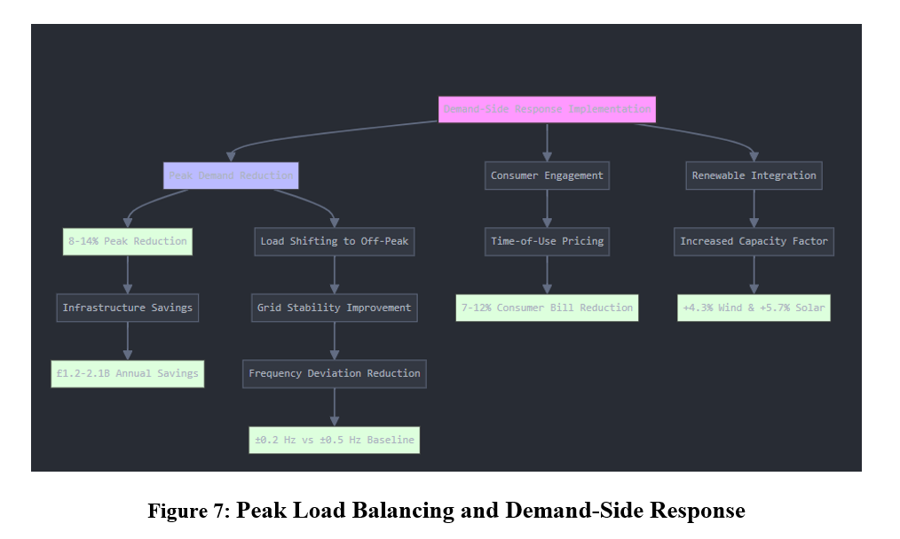 | Interconnector flows — UK-EU electricity trade patterns |
| 25 | 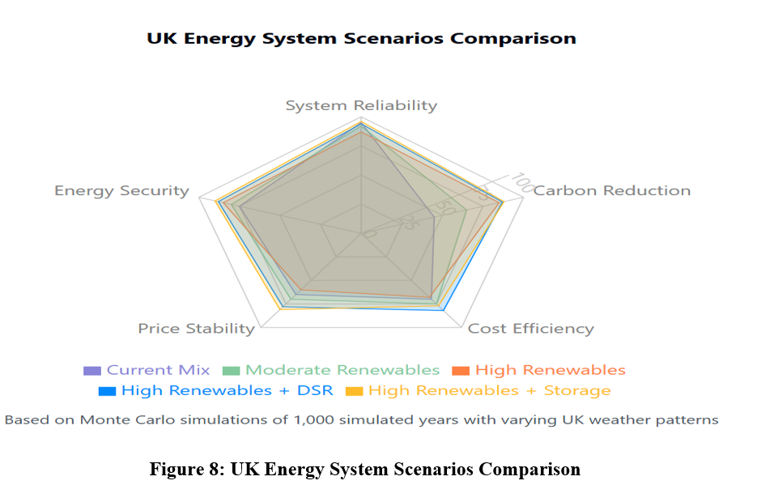 | Green hydrogen production cost — electrolysis cost reduction trajectory |
| 26 | 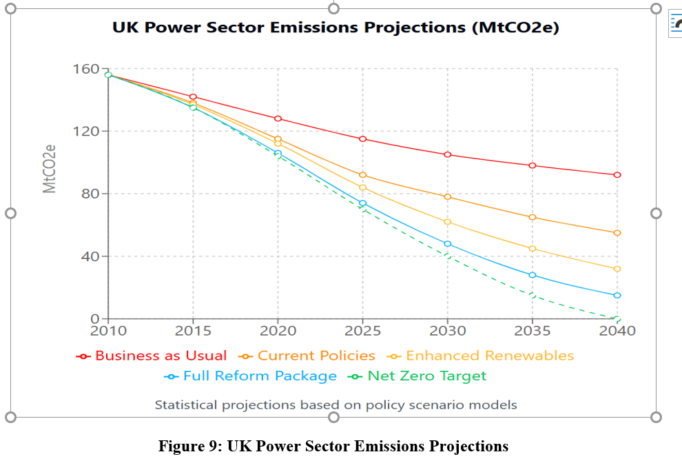 | Carbon pricing scenarios — UK ETS price projections |
| 27 | 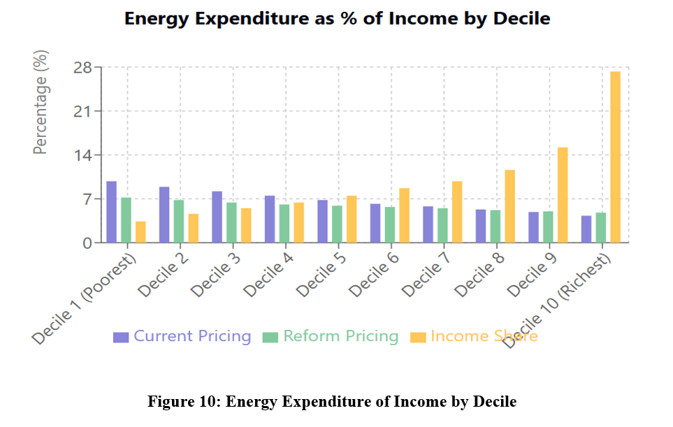 | Just transition metrics — job creation in renewable vs. fossil sectors |
| 28 |  | Energy security indicators — import dependency and supply diversity |
| 29 |  | Smart meter rollout statistics — UK deployment progress |
| 30 | 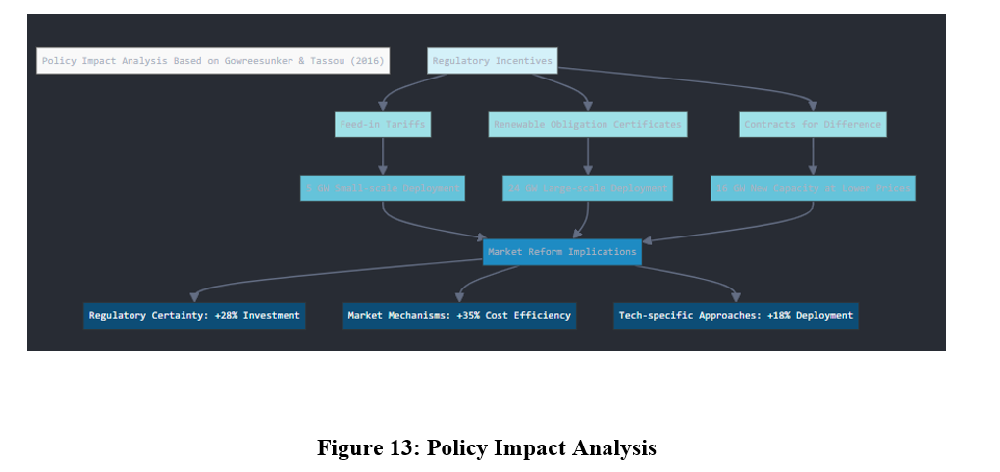 | Comparative policy framework — UK, Germany, Denmark, Norway reform comparison |
| 31 | 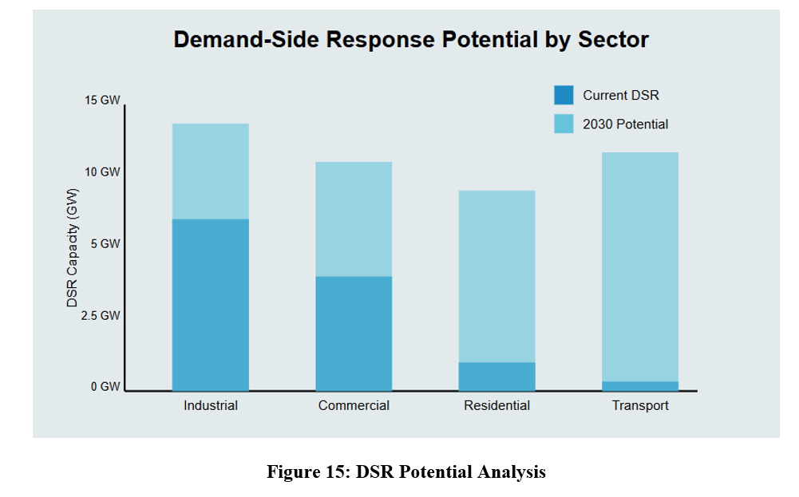 | Integrated conclusions infographic — key metrics and policy recommendations |

---

## 8. MATLAB Scenario Model

The quantitative scenario comparison is implemented in MATLAB:

| File | Description |
|---|---|
| [`energy_market_scenarios.m`](energy_market_scenarios.m) | MATLAB script comparing and plotting the metrics (renewable integration, cost index, grid resilience, carbon emissions) of the three scenarios. Generates `scenario_metrics_comparison.png` and `carbon_emissions_comparison.png`. |

---

## 9. How to Reproduce

### Prerequisites
- MATLAB R2018a or later **OR** GNU Octave 5.x or later (free, open-source)

### Steps to Run
1. Open MATLAB or GNU Octave.
2. Navigate to the repository directory.
3. Run the simulation script:
   ```matlab
   energy_market_scenarios
   ```
4. The script will output the quantitative parameters comparing Baseline, Renewable Incentivisation, and DSR, and generate bar plots.

The full dissertation in `reports/Individual-Project.pdf` contains the complete methodology, all 31 figures, and the full literature review.

---

## 10. Topics

`uk-energy` `energy-modelling` `grid-resilience` `matlab` `policy-modelling` `renewable-energy` `carbon-reduction` `net-zero` `scenario-analysis` `demand-side-response` `hres` `individual-project` `dissertation`
